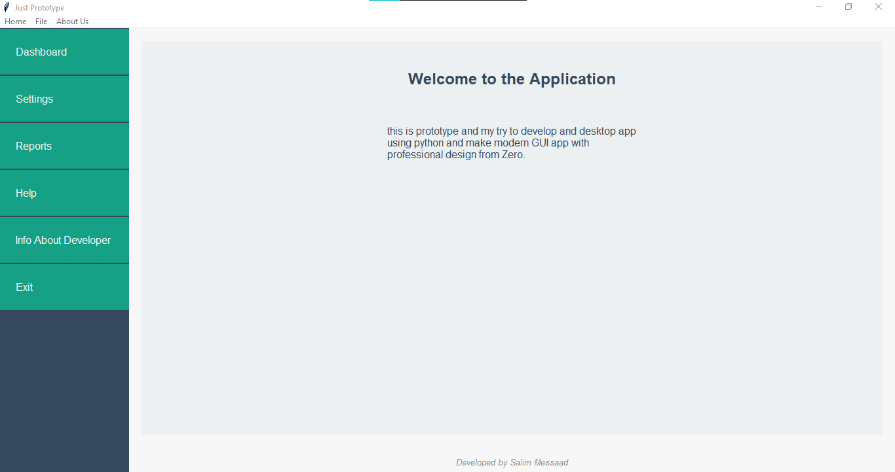

# Building a Desktop Application with Tkinter

Building a desktop application from scratch can be quite challenging, especially when working with Python, as the community often focuses more on web and data science applications than on desktop development. First, there's the struggle of choosing the right framework; options like Tkinter, PyQt, or Kivy can be overwhelming due to their varying complexities and documentation quality. Next, creating a visually appealing and user-friendly interface requires a solid understanding of design principles, which is not always well-covered in available resources. Additionally, integrating libraries for advanced functionalities can lead to compatibility issues, making the development process even more tedious. Overall, while Python is a powerful language, the lack of robust community support for desktop applications can make building one from the ground up a frustrating endeavor.

I recently embarked on a journey to create a desktop application using the powerful Tkinter library. Despite the challenges, I focused on leveraging Tkinter's features to build a user-friendly interface. The development process was both rewarding and insightful, allowing me to experiment with different layout designs and widget functionalities. I'm excited to share the results in a video that showcases the app in action, highlighting its key features and overall design. This project has enhanced my understanding of desktop development and the capabilities of Tkinter.

You can find the code up there and watch the video [Here](https://www.youtube.com/watch?v=cBfERubgwXU).

